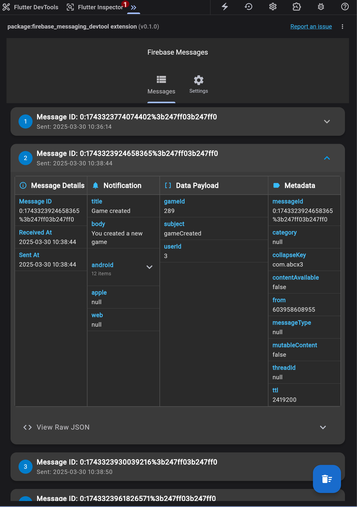
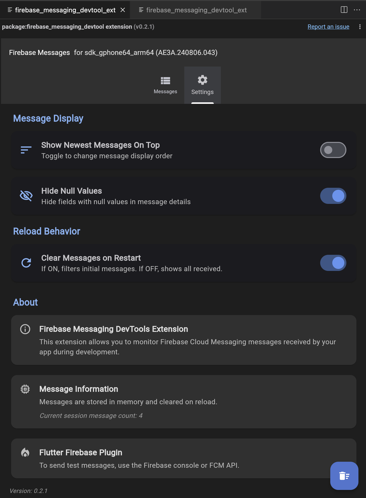

<!--
For information about how to write a good package README, see the guide for
[writing package pages](https://dart.dev/tools/pub/writing-package-pages).

For general information about developing packages, see the Dart guide for
[creating packages](https://dart.dev/guides/libraries/create-packages)
and the Flutter guide for
[developing packages and plugins](https://flutter.dev/to/develop-packages).
-->

# Firebase Messaging DevTool

A Flutter DevTools extension for inspecting Firebase Cloud Messaging (FCM) messages in real-time.

## Features

- Real-time display of incoming FCM messages
- Detailed message inspection with notification, data, and metadata sections
- Message persistence across app reloads
- Automatic device identification for debugging multiple devices
- Settings for message display preferences with persisted settings
- Auto-clear messages on reload option

## Installation

1. Add the package to your `pubspec.yaml`:
```yaml
dependencies:
  firebase_messaging_devtool: ^0.2.0
```

2. Install the DevTools extension:
```bash
flutter pub global activate firebase_messaging_devtool_extension_web
```

3. Run your app:
```bash
flutter run
```

## Usage

1. Start your Flutter app with the DevTools extension enabled
2. Open the DevTools extension in your browser
3. Send FCM messages to your app
4. View the messages in real-time in the DevTools extension

### Device Identification

The extension automatically detects and displays device information:

- **Android devices**: Shows the device model and unique ID
- **iOS devices**: Shows the device machine name and vendor ID
- **Web browsers**: Shows the browser name and platform
- **Desktop platforms**: Shows appropriate system information

The device identification makes it easier to debug applications across multiple devices simultaneously.

### Settings

The extension provides several settings to customize your experience:

- **Show newest messages on top**: Toggle to change the order of messages
- **Auto-clear messages on reload**: Enable to automatically clear messages when the app reloads
- **Clear all messages**: Manually clear all stored messages

All settings are persisted between sessions for a better user experience.

## Example

A complete example application is included in the `example` directory of this package. The example demonstrates:

- Setting up Firebase Messaging with proper configuration
- Implementing the DevTools integration
- Displaying the FCM token for testing
- Handling incoming messages

## Contributing

Contributions are welcome! Please feel free to submit a Pull Request.

## License

This project is licensed under the MIT License - see the LICENSE file for details.

## Screenshots

|  |  |

## Setup

1. **Add Dependency**: Add this package as a `dev_dependency` in your application's `pubspec.yaml`:

   ```yaml
   dev_dependencies:
     firebase_messaging_devtool: ^0.0.1
     # ... other dev_dependencies
   ```

2. **Enable the Extension**: Add the extension configuration to your `pubspec.yaml`:

   ```yaml
   # Add this at the top level, not nested under dependencies
   devtools:
     extensions:
       - firebase_messaging_devtool
   ```

3. **Run `flutter pub get`**