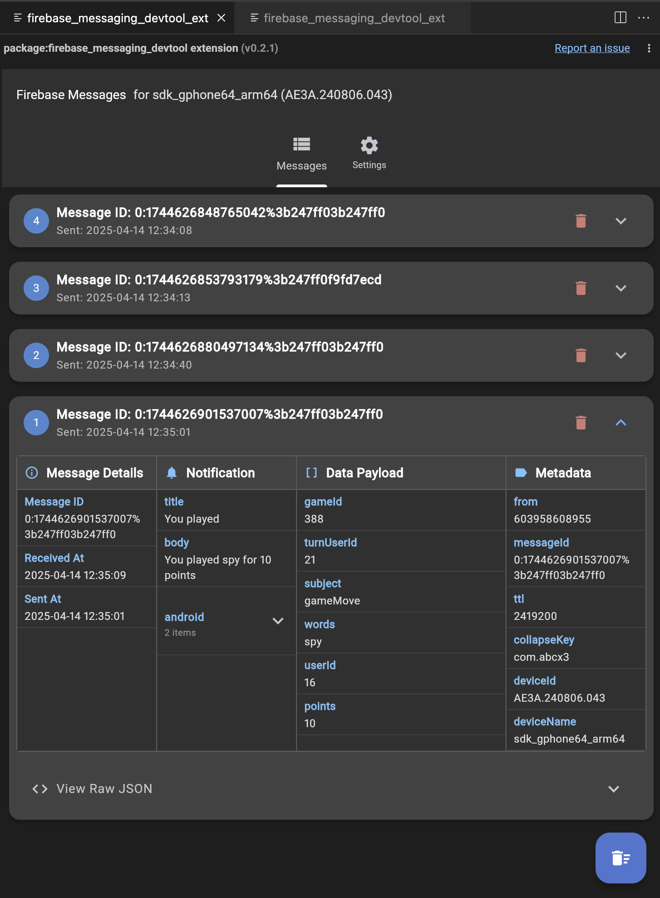

<!--
For information about how to write a good package README, see the guide for
[writing package pages](https://dart.dev/tools/pub/writing-package-pages).

For general information about developing packages, see the Dart guide for
[creating packages](https://dart.dev/guides/libraries/create-packages)
and the Flutter guide for
[developing packages and plugins](https://flutter.dev/to/develop-packages).
-->

# Firebase Messaging DevTool

A Flutter DevTools extension that displays Firebase Cloud Messaging (FCM) events in real-time, making it easier to debug and develop push notification functionality in your Flutter applications.

## Features

* **Real-time Monitoring**: View incoming FCM messages sent to your app as they arrive
* **Structured UI**: Messages are organized into tabbed sections (Notification, Data Payload, Metadata)
* **Expandable Details**: Navigate complex message structures with expandable sections
* **Message History**: Track all received messages during your debug session
* **Raw View**: Access the complete JSON data when needed
* **Extremely Simple Integration**: Just pass your Firebase RemoteMessage to a single function

## Screenshots

|  |  |

## Setup

1. **Add Dependency**: Add this package as a `dev_dependency` in your application's `pubspec.yaml`:

   ```yaml
   dev_dependencies:
     firebase_messaging_devtool: ^0.0.1
     # ... other dev_dependencies
   ```

2. **Enable the Extension**: Add the extension configuration to your `pubspec.yaml`:

   ```yaml
   # Add this at the top level, not nested under dependencies
   devtools:
     extensions:
       - firebase_messaging_devtool
   ```

3. **Run `flutter pub get`**

## Usage

The integration is now extremely simple:

1. **Import the helper function**:

   ```dart
   import 'package:firebase_messaging_devtool/firebase_messaging_devtool.dart';
   ```

2. **Pass the RemoteMessage directly** to the helper function in your message handlers:

   ```dart
   import 'package:firebase_messaging/firebase_messaging.dart';
   import 'package:firebase_messaging_devtool/firebase_messaging_devtool.dart';

   void setupFirebaseMessagingListener() {
     FirebaseMessaging.onMessage.listen((RemoteMessage message) {
       // Just pass the entire message directly to DevTools - that's it!
       postFirebaseMessageToDevTools(message);

       // Continue with your normal message handling...
     });

     // Don't forget to also add the same call to onBackgroundMessage handler if applicable
   }
   ```

That's all the code you need! The function automatically extracts all relevant information from the message, including:
- Message identifiers and timestamps
- Full notification details (including platform-specific parts)
- Complete data payload
- All available metadata

## Using the DevTools UI

Once integrated, the extension provides a rich interface for inspecting your messages:

1. **Main Tab**: Shows a list of all received messages
   - Each message shows its ID and timestamp
   - The most recent message is automatically expanded
   
2. **Message Details**: For each message, you can see:
   - **Notification Tab**: Title, body, and platform-specific notification details
   - **Data Payload Tab**: Your custom message data
   - **Metadata Tab**: Additional message properties like sender, collapse key, etc.
   
3. **Nested Data**: Complex nested objects and arrays are displayed as expandable trees

4. **Raw JSON**: Each message includes a "View Raw JSON" option to see the complete data

5. **Settings Tab**: Access message count and clear functionality

## Configuring Firebase Cloud Messaging

This extension works with any properly configured Firebase Cloud Messaging implementation. If you haven't set up FCM yet, follow these steps:

1. Set up a Firebase project and add your Flutter app following the [FlutterFire documentation](https://firebase.flutter.dev/docs/overview)
2. Add the `firebase_messaging` package to your app
3. Configure platform-specific settings (notification channels for Android, capabilities for iOS, etc.)
4. Request notification permissions in your app
5. Set up your message handlers where you'll call `postFirebaseMessageToDevTools`

## Testing with FCM messages

To test your Firebase messages and verify the extension is working:

1. Use the Firebase Console to send test messages
2. Use the Firebase CLI to send messages programmatically
3. Set up a simple backend with the Firebase Admin SDK to send test messages
4. For local testing, use the `FirebaseMessaging.onMessage` stream in combination with a local notification package

## Troubleshooting

**Extension not appearing in DevTools?**
* Ensure the package is in `dev_dependencies` not `dependencies`
* Verify you've added the `devtools: extensions:` section to your `pubspec.yaml`
* Check that you're running in debug mode
* Restart DevTools completely

**Messages not showing up?**
* Verify your FCM configuration is working correctly by checking logs
* Ensure you have passed the whole RemoteMessage object to `postFirebaseMessageToDevTools`
* Check that you've enabled the extension in DevTools when prompted

## Contributing

Contributions to improve the extension are welcome! Please feel free to submit issues or pull requests to the [GitHub repository](https://github.com/abcx3/firebase_messaging_devtool).

## License

This project is licensed under the MIT License - see the [LICENSE](LICENSE) file for details.
